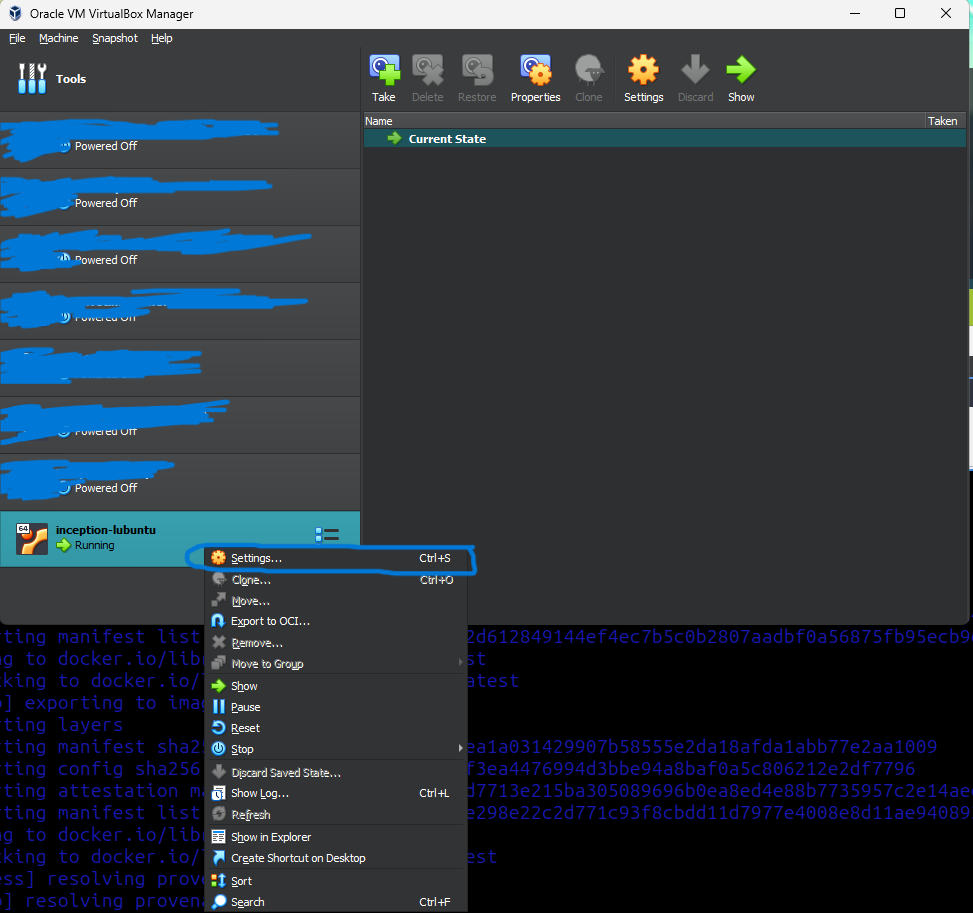
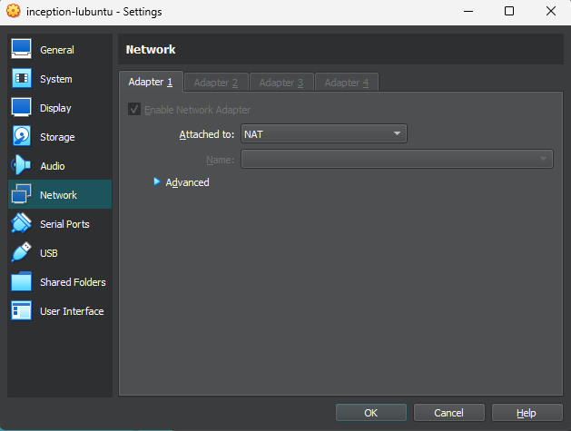
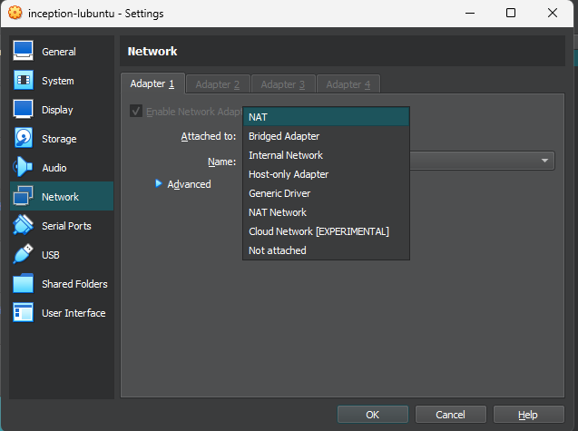
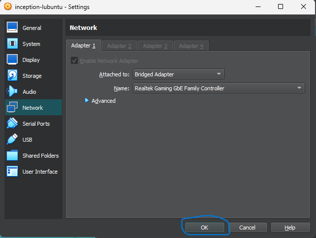

# How to set up the environment from scratch
## Prerequisites
- Virtual Box (7.0.18r162988).
- ISO image of the latest version of [Lubuntu](https://cdimage.ubuntu.com/lubuntu/releases/noble/release/) (currently using lubuntu-24.04.4-desktop-amd64).

### To install the following dependencies visit this [repo](https://github.com/danielfdez17/scripts/blob/main/inception/install.sh).
- Docker
- Docker compose
- make

## Configuration files
To set up the project structure visit this [repo](https://github.com/danielfdez17/scripts/blob/main/inception/inception.sh) and will look like this:

```bash
.
├── DEV_DOC.md
├── images
│   ├── SelfSigned_SSL_Warning.png
│   ├── SSLAdvancedOptions.png
│   ├── VBoxNetworkDropdown.png
│   ├── VBoxNetworkSaveButton.png
│   ├── VBoxNetworks.png
│   └── VBoxSettings.png
├── Makefile
├── README.md
├── srcs
│   ├── docker-compose.yml
│   └── requirements
│       ├── mariadb
│       │   ├── conf
│       │   │   └── mariadb-server.cnf
│       │   ├── Dockerfile
│       │   └── tools
│       │       └── setup.sh
│       ├── nginx
│       │   ├── conf
│       │   │   └── nginx.conf
│       │   ├── Dockerfile
│       │   └── tools
│       │       └── setup.sh
│       └── wordpress
│           ├── conf
│           │   └── www.conf
│           ├── Dockerfile
│           └── tools
│               └── script.sh
└── USER_DOC.md
```

## Secrets
To set up the environmental variables for the project visit this [repo](https://github.com/danielfdez17/scripts/blob/main/inception/scripts/env.sh).

## Update docker volumes location
1. Stop docker
```bash
sudo systemctl stop docker
```
2. Create destination and move actual data (if there exists)
```bash
sudo mkdir -p /home/danfern3/data/docker
sudo rsync -aHAX /var/lib/docker/ /home/danfern3/data/docker/
```
3. Setup daemon to use the new route
```bash
sudo touch /etc/docker/daemon.json
echo '{"data-root": "/home/danfern3/data/docker"}' | sudo tee /etc/docker/daemon.json
```
4. Start docker
```bash
sudo systemctl start docker
```
5. Check the new location
```bash
docker info | grep "Docker Root Dir"
docker volume ls
```


# How to build and launch the project (Makefile + Docker Compose)
The project will be compiled and executed by running `cd inception && make all`

# Relevant commands to deal with containers and volumes
- To know what rules are available run `make help`.
- To start the project, just run `make all`.
- To stop the docker containers, execute `make down`.
- To know which images have been built and which docker containers are running, execute `make st`.
- To stop the containers and remove the images run `make clean`.
- To rebuild the project execute `make re`.

# Where the project data is stored and how it persist
The project data will be stored in the home of the user (danfern3 in this case): `/home/danfern3/data`.

# :warning: Important :warning:
***As this project needs to be done on a VM, i decided to configure a FTP server in the VM to upload the project from the host OS.***
- [Set up FTP server on a VM](https://medium.com/@tpriyanshu/how-to-create-an-ftp-server-on-a-linux-virtual-machine-hosted-on-cloud-4f4eace5c8a5).
- Important: enable write_access to upload the project to the VM.

First of all, network adapter needs to be updated. If it's not changed, the connection between host and VM will not be bidirectional (i.e. you can ping from VM to Host but not the reverse way)
# ***Insert images***

1. Open the settings of the VM.
	<p align="center">
	
	</p>
2. Go to Network.
	<p align="center">
	
	</p>
3. In the dropdown **Attached to** select ***Bridge Adapter***.
	<p align="center">
	
	</p>
4. Save the changes.
	<p align="center">
	
	</p>
<br>

### Setting up the FTP server in the VM

1. Once VM has been powered up, run 'ip a' to know the IP address of the VM
2. Follow the guide until the write_access is enabled
3. In the host machine, the project to be uploaded needs to be compressed with the command 'tar -czvf <folder_name>.zip <desired_folder>'
4. From the host machine, connect to the VM's FTP server (ftp \<VM username>@\<VM IP address>). Enter your password to access the VM, and you will be in.
5. To upload files run put <desired_file>. If you encounter any problem with passive mode, just run the command 'passive' and this mode will change
6. In the VM check if the folder has been transferred properly
7. Uncompress the file running the command 'tar xf <folder_name>.zip
