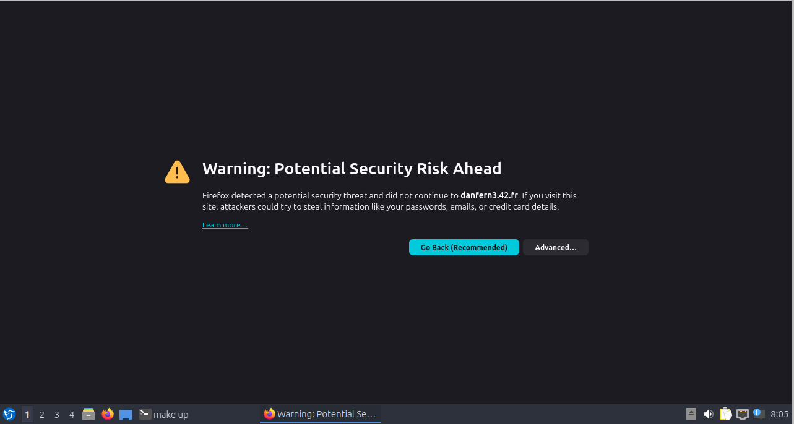
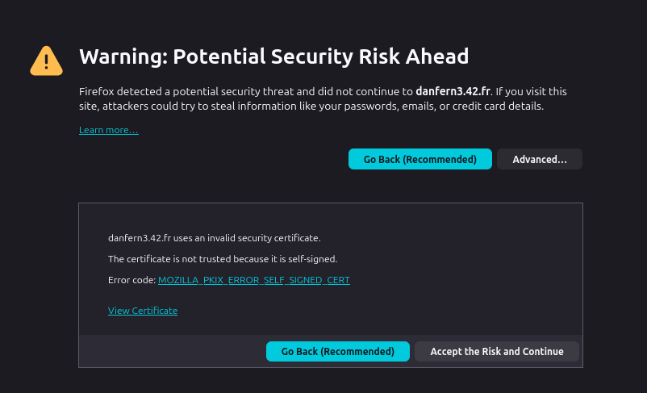

# What services are provided by the stack.

This inception project has to offer only three services:
- MariaDB: a database server
- WordPress: a website
- Nginx: a HTTP server 

# How to start and stop the project.
- To start the project just run `make all`.
- To stop the docker containers, execute `make down`.
- To get some help, execute `make help`.
- If you have any problem, execute `make re` to rebuild the project.

# How to access the website and the administration panel.

### Access the website
1. Visit https://danfern3.42.fr.
2. You will be propmted with the following warning.
	

	
	

3. Just ignore it by clicking `Advanced...` and the `Accept the Risk and Continue` button.
	

	
	

### Access the administration panel
1. Visit https://danfern3.42.fr/wp-admin
2. Enter the either the admin or the normal user credentials located in the `.env` file.

# Where to locate and manage credentials.

- The credentials will be in `/srcs/.env`
- If you want to change them, feel free to do it. If you do so, remember to restart the project.

# How to check the services are running.
- To check if the services are running, execute `make st` or `docker ps`.

:warning: If there is no running docker container, check if the environmental variables has been set. :warning:
